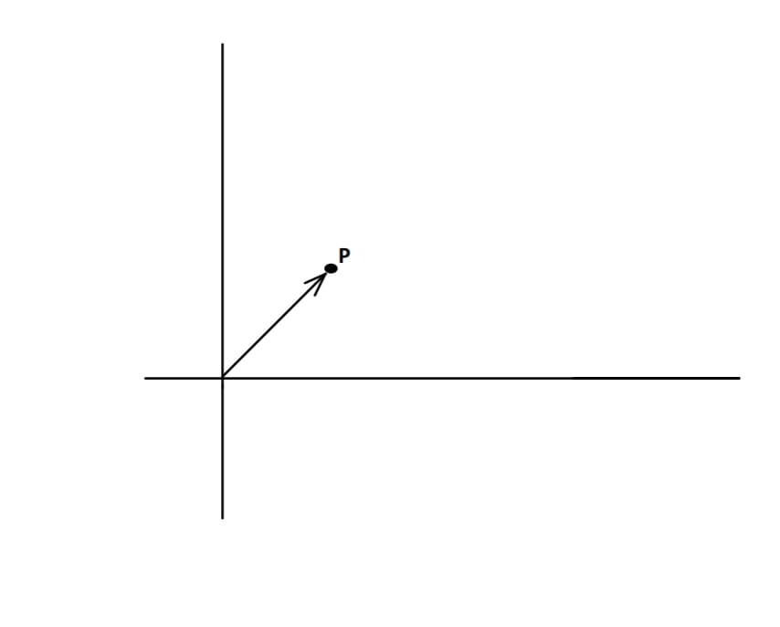

Let N and R denote the natural numbers and real numbers respectively.

**1. 2-dimensional Euclidean Space:**
 The system ( R2 ,+ , . ) together with R is the 2-dimensional Euclidean space, where

**(i)** R2 = { (x , y) | (x , y) ∈ R}  
**(ii)** + , called addition, is defined as  
&emsp; (a , b) + (c , d) = ( a+c , b+d ); where (a , b) and (c , d) ∈ R2  
**(iii)** . , called scalar multiplication, is defined as   
&emsp; α . (a , b) = (α . a , α . b); where α ∈ R and (a , b) ∈ R2 .  

Note that,

**a.** In (ii), "+" on the left side is the addition of R2 and on the right side it is the addition of R. 
**b.** In (iii), "." on the left side is the scalar multiplication of R2 and on the right side it is the multiplication of R.

**2. Geometric Visualization:**
It is well known that there is a one-to-one correspondence between the plane and R2. That is, for each point on the plane there corresponds an element of R2 and conversely, to each point in the plane there is an element of R2. **It may be noted** that this association between points in the plane and the elements in R2 is with respect to a given pair of axes. Thus given a point on the plane, if we change the chosen axes, the element in R2 may be changed. Similarly, given an element in R2, if we change the chosen axes, a different point on the plane may be obtained. 
In the same manner, R and R3 can be identified with the line and space respectively. Such a visualization is not possible for Rn , for n>3.

**3. Math Model of Line, Plane and Space:**
The one-to-one correspondence between the plane and R2, described above provides an identification of plane with R2. Therefore R2 serves as a mathematical model for the study of the plane. Similarly, R and R3 serve as mathematical models for the study of the line and the space respectively.

**4. Vector Representation:**
 Let P be a point on the plane and (u , v) be the corresponding ordered pair. The line segment joining the origin and the point directed towards the point is called the vector at the origin associated with the point P. Please see the diagram given below.

 

**5. n-dimensional Euclidean Space:**
 It is the system ( Rn , + , . ) together with R, where Rn = {(x1, x2, x3, ... , xn) | x1, x2, x3, ... , xn ∈ R} and operations + and . called addition and scalar multiplication respectively are defined as:

**(i)** {(x1, x2, x3, ... , xn) + (y1, y2, y3, ... , yn) = (x1+y1 , x2+y2 , ... , xn+yn)}; where (x1, x2, x3, ... , xn) , (y1, y2, y3, ... , yn) ∈ Rn  
**(ii)** α . (x1, x2, x3, ... , xn) = (α.x1, α.x2, α.x3, ... , α.xn); where α ∈ R and (x1, x2, x3, ... , xn) ∈ Rn

It can be geometrically visualised for 1≤n≤3 only. 

**6. Vector Space:**
 Let F=R or C, where C is the field of complex numbers. Given a non-empty set V and operations "+" **(called addition)** and "." **(called scalar multiplication)**, the system (V , + , .) together with F is called a **vector space** over F, if the following conditions hold:

**For Addition:**  
&emsp; **i.** For each pair of elements x, y ∈ V, there is a unique element x + y ∈ V   
&emsp; **ii.** Commutativity: x + y = y + x; for x, y ∈ V  
&emsp; **iii.** Associativity: (x + y) + z = x + (y + z), for x, y, z ∈ V  
&emsp; **iv.** Additive identity: There exists an element O ∈ V s.t. x + O = x, for x ∈ V. 
&emsp;  &emsp; This O which is the additive identity of (V, +), is called the zero of V and is denoted by 0. 
&emsp; **v.** Additive inverse: For every x ∈ V, there exists an element y ∈ V s.t. x + y = 0. This y is called the additive inverse of x and is denoted by -x.

**For Scalar Multiplication:**  
&emsp; **i.** For each x ∈ V and a ∈ F, there is a unique element a.x ∈ V  
&emsp; **ii.** Associativity: (ab).x = a.(bx) = x.(ab); for x ∈ V and a, b ∈ F.  
&emsp; **iii.** 1.x = x.1 = x, for x ∈ V, where 1 is the additive identity of F.

**Compatibility Conditions:**  
&emsp; **i.** Distributive Property 1: a.(x+y) = a.x + a.y; for x, y ∈ V and a ∈ F.   
&emsp; **ii.** Distributive Property 2: (a+b).x = a.x + b.x; for x ∈ V and a, b ∈ F. 

**NOTE:** The elements of F are called **scalars** and the elements of V are **vectors**. A vector space over F will be denoted by V.

**7. Example**  
&emsp; **i.** The system (Rn, +, .) is a vector space over R, where addition and scalar multiplication are described above. The zero of this vector space is 0≡(0, 0, 0, …, 0). Thus elements of Rn are vectors and elements of R are scalars. In the particular case when n=1, elements of R are both vectors and scalars.  
&emsp; **ii.** The system (M2x2, +, .) is a vector space over R, 
 
 
**iii.** The system (R2, +, .) is not a vector space over R, where operations addition and scalar multiplication are described as follows: (x, y)+(a, b)=(x+a, 0), where x, y, a, b&isin;R and c(x, y)=(cx, 0); where c, x, y&isin;R. Reason:  There does not exist (a, b) such that (2,1)+(a, b)=(2,1) because if exists, then (2+a, 0)=(2, 1) i.e. 0=1, a contradiction.  
 
**8. Properties**
Let V be a vector space over R. For v, w ∈ V and α ∈ F,

&emsp; **A.** 0.v = 0  
&emsp;&emsp;   (0 on the left side is the zero of F and on the right side it is the zero of V)  
&emsp; **B.** α.v = 0 implies α = 0 or v = 0 
&emsp;&emsp;   (-1).x = -x, x ∈ V, -1 ∈ F  
&emsp; **C.** α.v = α.w and α ≠ 0 implies v = w. 
&emsp; **D.** Notice that v.w and v.α are not defined.

**9. Significance**
The study of n-dimensional Euclidean space has enlightened research in many broad areas of science over the period of time. n-dimensional spaces have since become one of the foundations for formally expressing modern mathematics and physics.
